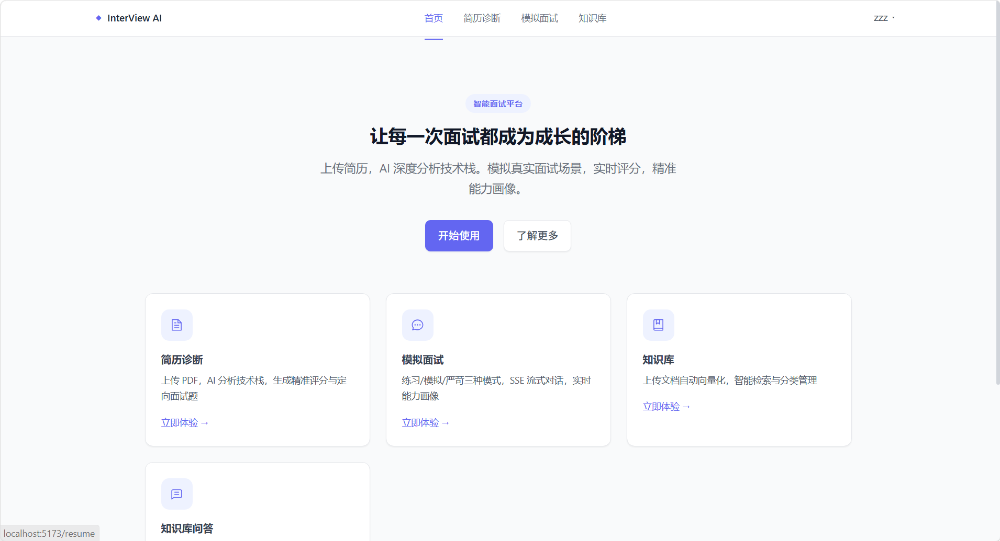
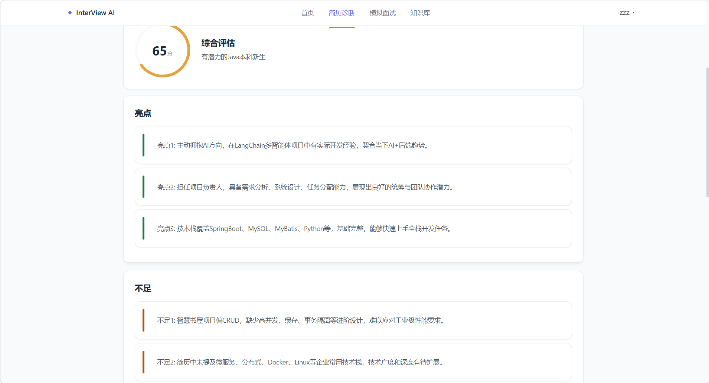
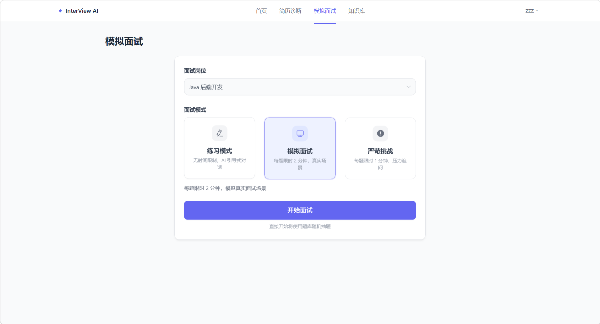
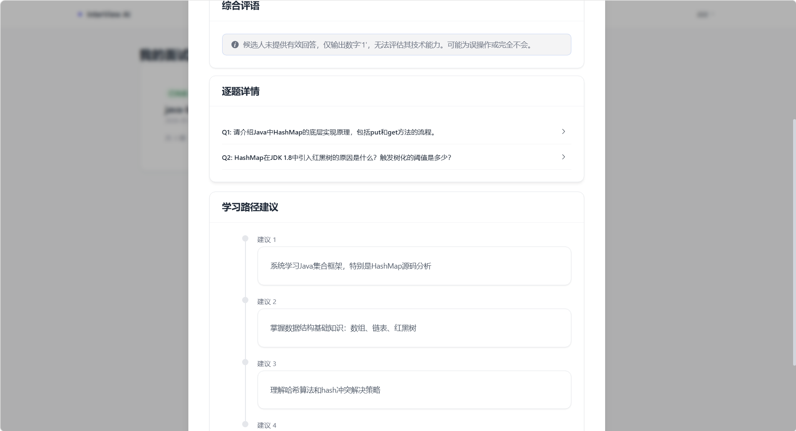
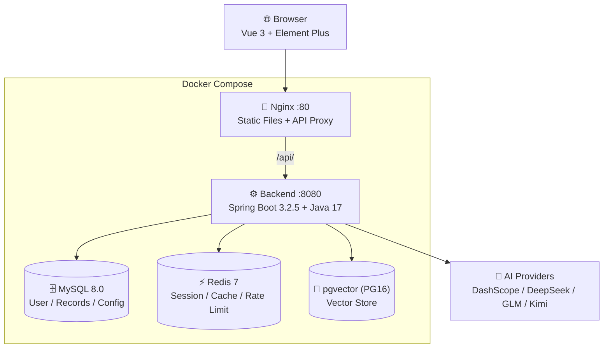
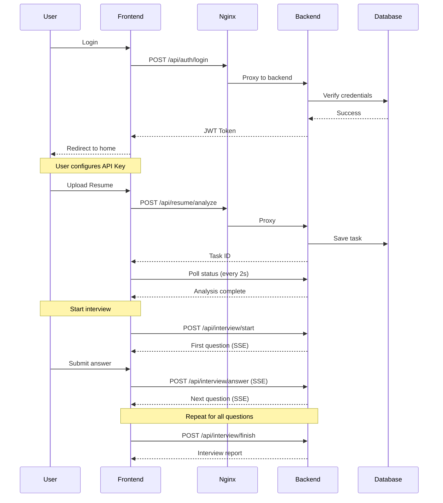

<div align="center">

# 🤖 InterView AI

**AI-Driven Mock Interview Platform** · **AI 驱动的智能模拟面试平台**

[](LICENSE)
[](https://www.oracle.com/java/)
[](https://spring.io/projects/spring-boot)
[](https://vuejs.org/)
[](https://www.docker.com/)

</div>

---

## 📖 Overview · 项目简介

<p>
<b>English:</b> InterView AI is a full-stack mock interview platform powered by AI. It supports resume analysis, multi-mode mock interviews (SSE streaming), knowledge base RAG (Retrieval-Augmented Generation), and skill assessment scoring.
</p>

<p>
<b>中文：</b>InterView AI 是一个 AI 驱动的全栈模拟面试平台，支持简历诊断、多模式模拟面试（SSE 流式对话）、知识库 RAG 问答以及能力画像评分。
</p>

---

## ✨ Features · 功能特性

<table>
<tr>
<td width="50%">

### 📄 Resume Analysis · 简历诊断
- Upload PDF/DOCX — AI extracts tech stack, generates score, strengths, weaknesses, and tailored interview questions
- **上传 PDF/DOCX** — AI 提取技术栈，生成评分、亮点、不足与定制面试题

</td>
<td width="50%">

### 🎤 Mock Interview · 模拟面试
- 3 modes (Practice / Simulation / Strict) with SSE streaming dialogue, follow-up追问 per question
- **三种模式（练习/模拟/严苛）**，SSE 流式对话，逐题追问

</td>
</tr>
<tr>
<td width="50%">

### 📊 Skill Assessment · 能力画像
- 4-dimension scoring (Technical / Logic / Breadth / Practice) with auto evaluation and learning path recommendations
- **四大维度评分**（技术/逻辑/广度/实践），自动评估与学习路线推荐

</td>
<td width="50%">

### 📚 Knowledge Base RAG · 知识库问答
- Upload documents — AI answers questions based on your knowledge base context via vector search
- **上传文档**，AI 基于知识库向量检索上下文回答问题

</td>
</tr>
<tr>
<td width="50%">

### 🔄 Multi-Round Session · 多轮对话
- Redis-based session management, supports interruption and resume
- **Redis 会话管理**，支持中断恢复

</td>
<td width="50%">

### 🔌 Multiple AI Providers · 多服务商支持
- Alibaba DashScope, DeepSeek, Zhipu GLM, Moonshot Kimi — user brings their own API key
- **阿里云百炼、DeepSeek、智谱 GLM、Moonshot Kimi** — 用户自行配置 API Key

</td>
</tr>
</table>

---

## 📸 Screenshots · 界面预览

| 🏠 Home Page · 首页 | 📄 Resume Analysis · 简历分析 |
|:---:|:---:|
|  |  |

| 🎤 Mock Interview · 模拟面试 | 📊 Interview Report · 面试报告 |
|:---:|:---:|
|  |  |

---

## 🏗 Architecture · 系统架构



### Request Flow · 请求流程



---

## 🚀 Quick Start · 一分钟快速启动

### Prerequisites · 前提条件

- Install [Docker](https://docker.com) (Desktop for Windows/Mac, Engine for Linux)
- Install [Docker Compose](https://docs.docker.com/compose/install/) (included in Docker Desktop)

### One-Click Deploy · 一键部署

```bash
# 1. Clone the repository · 克隆仓库
git clone https://github.com/your-username/interview-ai.git
cd interview-ai

# 2. Start all services · 一键启动所有服务
docker-compose up -d
```

> ⏳ First startup may take 3-5 minutes (Maven downloads dependencies, npm installs packages).

### Access · 访问

Open your browser and visit: **http://localhost:80**

---

## 📋 User Guide · 使用指南

```
1. Register an account · 注册账号
2. Log in · 登录
3. Go to Settings → Add your AI API Key · 前往设置 → 填入 API Key
4. Upload your resume or start a mock interview · 上传简历或开始面试
5. Review performance reports · 查看面试报告
```

### Supported AI Providers · 支持的 AI 服务商

| Provider · 服务商 | Chat · 聊天 | Embedding · 向量化 | Base URL |
|---|---|---|---|
| 阿里云百炼 DashScope | ✅ | ✅ `text-embedding-v3` | `dashscope.aliyuncs.com` |
| DeepSeek | ✅ | ❌ | `api.deepseek.com` |
| 智谱 GLM | ✅ | ✅ `embedding-3` | `open.bigmodel.cn` |
| Moonshot Kimi | ✅ | ❌ | `api.moonshot.cn` |

---

## ⚙️ Configuration · 自定义配置

### Environment Variables · 环境变量

All sensitive defaults can be overridden via environment variables (optional for production):

| Variable | Default | Description |
|----------|---------|-------------|
| `JWT_SECRET` | `MyJWTSecretKey...` | JWT signing key |
| `ENCRYPTION_KEY` | `InterviewAISecret2024` | AES encryption key for API Key storage |
| `DB_PASSWORD` | `123456` | MySQL root password |
| `PG_PASSWORD` | `vector_pass` | pgvector password |

```bash
# Example: start with custom secrets
JWT_SECRET=your-secure-key ENCRYPTION_KEY=your-key docker-compose up -d
```

### Port Mapping · 端口映射

| Service | Internal Port | External Port |
|---------|:------------:|:-------------:|
| Frontend (Nginx) | 80 | 80 |
| Backend (Spring Boot) | 8080 | 8080 |
| MySQL | 3306 | 3306 |
| Redis | 6379 | 6379 |
| pgvector | 5432 | 5432 |

---

## 🛠 Tech Stack · 技术栈

| Layer · 层次 | Technology · 技术 | Version |
|--------------|-------------------|---------|
| Backend · 后端 | Spring Boot + Java 17 | 3.2.5 |
| Frontend · 前端 | Vue 3 + Vite + Element Plus | 3.4 / 5.4 / 2.8 |
| Business DB · 业务数据库 | MySQL | 8.0 |
| Vector DB · 向量数据库 | PostgreSQL + pgvector | 16 |
| Cache · 缓存 | Redis (Lettuce) | 7 |
| AI Engine · AI 引擎 | Spring AI (OpenAI-compatible) | 1.0.0-M4 |
| Document Parsing · 文档解析 | Apache Tika + PDFBox | 3.0 / 3.0.2 |
| Auth · 认证 | JWT (jjwt 0.12.5) + Spring Security | HMAC-SHA256 |

---

## 📁 Project Structure · 项目结构

```
interview-ai/
├── docker-compose.yml           # 5-service orchestration · 五服务编排
├── Dockerfile                   # Backend Docker build · 后端构建
├── frontend/
│   ├── Dockerfile               # Frontend Docker build · 前端构建
│   ├── nginx.conf               # Nginx config · Nginx 配置
│   └── src/                     # Vue source · Vue 源码
│       ├── views/               # Pages · 页面
│       ├── components/          # Reusable components · 组件
│       ├── api/                 # API client · API 客户端
│       └── router/              # Routes · 路由
├── src/
│   ├── main/java/com/interviewai/
│   │   ├── controller/          # REST API · 接口层
│   │   ├── service/             # Business logic · 业务层
│   │   ├── config/              # Security, AI, DB config · 配置
│   │   ├── entity/              # JPA entities · 实体
│   │   └── repository/          # Data access · 数据访问
│   └── main/resources/
│       ├── application.yml      # Main config · 主配置
│       ├── prompts/             # AI prompt templates · 提示词模板
│       └── skills/              # Interview skill definitions · 面试方向定义
└── README.md
```

---

## 📄 License · 许可证

This project is licensed under the MIT License — see the [LICENSE](LICENSE) file for details.

本项目基于 MIT 许可证开源，详见 [LICENSE](LICENSE) 文件。

---

<div align="center">
  <sub>Built with ❤️ for developers who want to ace their interviews</sub>
  <br/>
  <sub>为帮助开发者通过面试而构建</sub>
</div>
